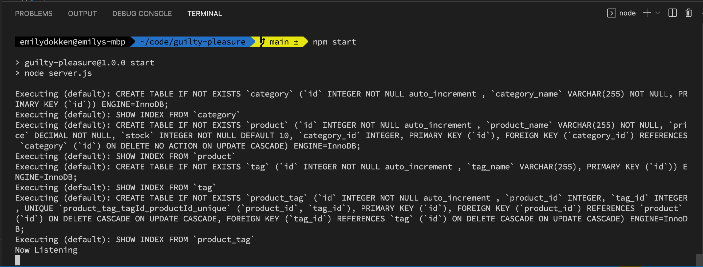
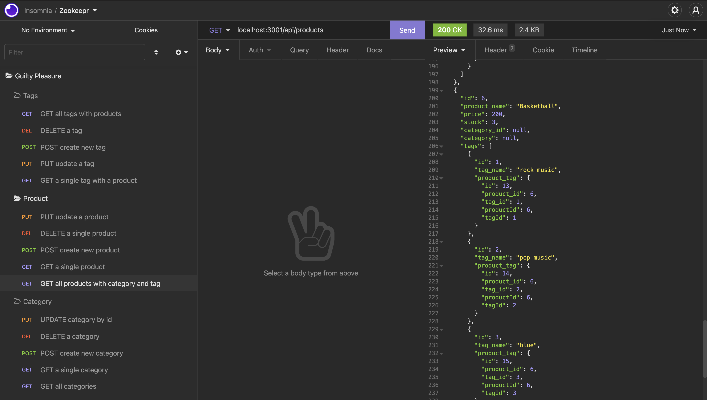

# Guilty Pleasure

## Description

In order to provide a connection between a large ecommerce website's database and their express API, this project uses Sequelize to communicate with the MySQL server and provide data for the API routes in express. At this time you can query Products, Tags, and Categories for all products in the database, you can do the following with the provided routes:

1. Get all Products, Tags, and Categories
2. Get a single Product, Tag, or Category
3. Create a new Product, Tag, or Category
4. Update a Product, Tag, or Category
5. Delete a Product, Tag, or Category

## Table of Contents (Optional)

If your README is long, add a table of contents to make it easy for users to find what they need.

- [Installation](#installation)
- [Usage](#usage)
- [Credits](#credits)
- [License](#license)

## Installation

1. Clone the repo
2. Run `npm install` to insall all dependencies
3. Create a `.env` file and include your username and password for MySQL

## Usage

In order to run the project after installation, do the following:
1. `npm start` to create database and tables
2. Once database and tables created, turn off server
3. Type `npm run seed` to seed tables in database
4. Once seeded run `npm start`, open Insomnia to use associated API Routes

Screenshot of Application on Start:

Screenshot of all available API Routes in Insomnia:

## Credits

- [MySQL](https://www.mysql.com/)
- [Sequelize](https://sequelize.org/v7/)
- [DOTENV](https://www.npmjs.com/package/dotenv)
- [Express](http://expressjs.com/)

## License

MIT License

Copyright (c) [2022] [Emily Dokken]

Permission is hereby granted, free of charge, to any person obtaining a copy
of this software and associated documentation files (the "Software"), to deal
in the Software without restriction, including without limitation the rights
to use, copy, modify, merge, publish, distribute, sublicense, and/or sell
copies of the Software, and to permit persons to whom the Software is
furnished to do so, subject to the following conditions:

The above copyright notice and this permission notice shall be included in all
copies or substantial portions of the Software.

THE SOFTWARE IS PROVIDED "AS IS", WITHOUT WARRANTY OF ANY KIND, EXPRESS OR
IMPLIED, INCLUDING BUT NOT LIMITED TO THE WARRANTIES OF MERCHANTABILITY,
FITNESS FOR A PARTICULAR PURPOSE AND NONINFRINGEMENT. IN NO EVENT SHALL THE
AUTHORS OR COPYRIGHT HOLDERS BE LIABLE FOR ANY CLAIM, DAMAGES OR OTHER
LIABILITY, WHETHER IN AN ACTION OF CONTRACT, TORT OR OTHERWISE, ARISING FROM,
OUT OF OR IN CONNECTION WITH THE SOFTWARE OR THE USE OR OTHER DEALINGS IN THE
SOFTWARE.